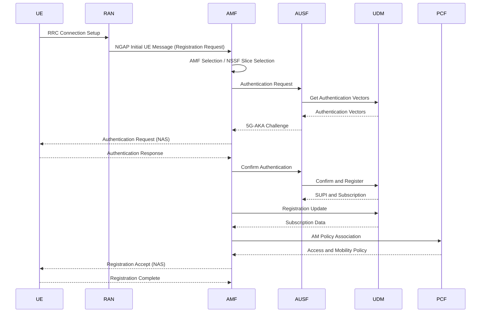
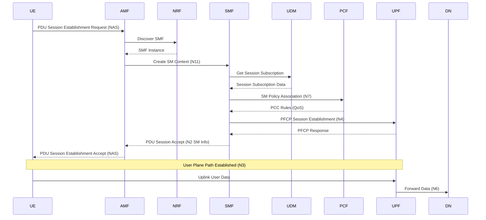
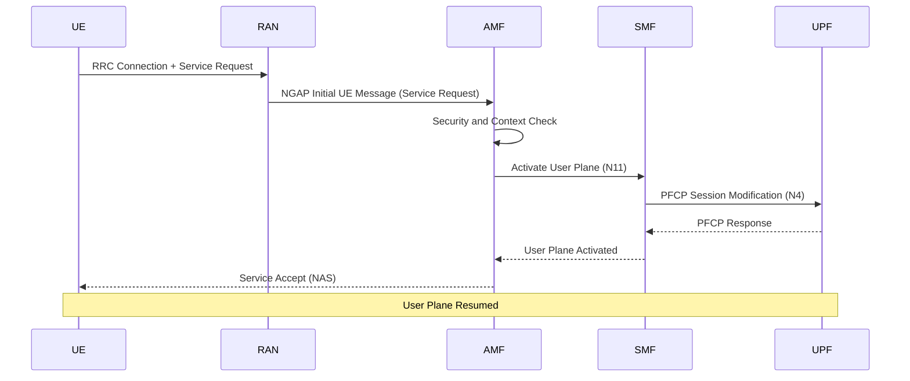
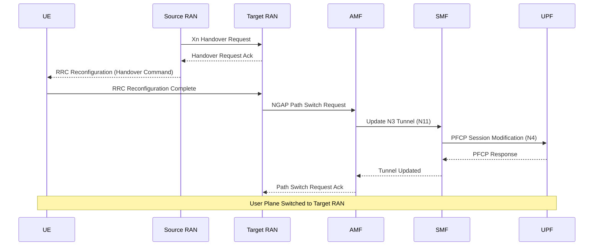
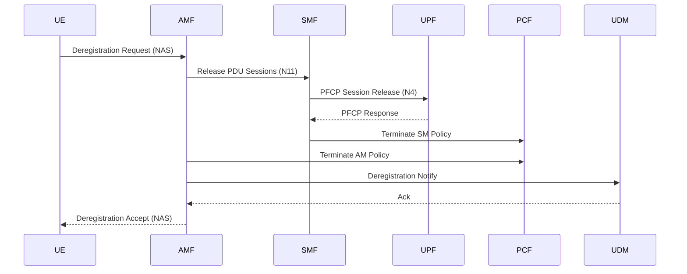
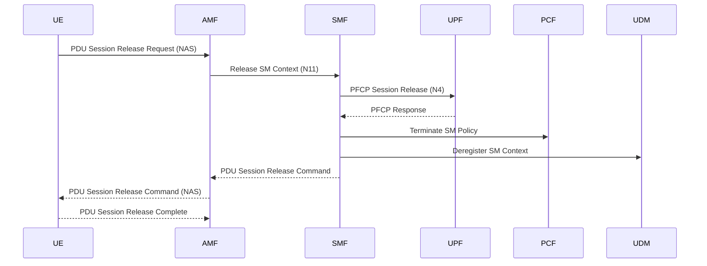

# Core Network Procedures

This page describes typical 5G core network procedures based on 3GPP **TS 23.502** (5G system procedures). Each procedure lists its **purpose**, the **involved NFs**, a **sequence diagram**, and the **key steps**. For NF function definitions, see [3GPP Network Function Functions](/docs/nf-functions).

> Note: the sequence diagrams are simplified illustrations focusing on the main signaling interactions; some optional steps and failure branches are omitted.

---

## 1. Registration (§4.2.2.2)

**Purpose**: the UE registers with the network to obtain service, completing authentication and establishing a mobility context.

**Involved NFs**:

| NF | Role |
|----|------|
| UE | Initiates the registration request |
| (R)AN | Radio access, forwards NGAP signaling |
| AMF | Registration / mobility anchor, security anchor |
| AUSF | Performs access authentication |
| UDM | Provides authentication vectors and subscription data |
| NSSF | Network slice selection |
| PCF | Provides access and mobility policy |

**Key steps**:
1. The UE sends a registration request via the (R)AN (N1/N2).
2. The AMF is selected / redirected, and slice selection is done via the NSSF.
3. The AMF runs 5G-AKA authentication with the AUSF / UDM.
4. The AMF fetches subscription data from the UDM and sets up an AM policy association with the PCF.
5. The AMF sends Registration Accept; the UE replies with Registration Complete.

---

## 2. PDU Session Establishment (§4.3.2.2)

**Purpose**: establish a user-plane connection from the UE to a data network (DN) and allocate an IP address.

**Involved NFs**:

| NF | Role |
|----|------|
| UE | Initiates the session establishment request |
| AMF | Forwards session signaling, selects the SMF |
| NRF | SMF service discovery |
| SMF | Session control, selects / controls the UPF |
| UDM | Session subscription data |
| PCF | Session policy (PCC / QoS) |
| UPF | User-plane anchor, data forwarding |
| DN | External data network |

**Key steps**:
1. The UE initiates a PDU session establishment request via the AMF.
2. The AMF discovers and selects an SMF through the NRF and creates an SM context.
3. The SMF fetches session subscription data from the UDM and PCC / QoS policy from the PCF.
4. The SMF selects and configures a UPF over N4 (PFCP), establishing the user-plane tunnel.
5. The SMF sends session establishment accept via the AMF; the UE gets an IP address and the user plane is up (N3/N6).

---

## 3. Service Request (§4.2.3.2)

**Purpose**: move a UE in CM-IDLE back to CM-CONNECTED and re-activate the user plane.

**Involved NFs**:

| NF | Role |
|----|------|
| UE | Initiates the service request |
| (R)AN | Re-establishes the radio connection |
| AMF | Connection management, triggers user-plane activation |
| SMF | Session context, activates the UPF |
| UPF | Resumes user-plane forwarding |

**Key steps**:
1. The UE in idle mode initiates a service request and re-establishes the connection via the (R)AN.
2. The AMF performs security and context checks.
3. The AMF notifies the relevant SMF to activate the user plane; the SMF updates the UPF over N4.
4. The AMF sends Service Accept and the user plane resumes.

---

## 4. Xn-based Handover (§4.9.1.2)

**Purpose**: as the UE moves between two base stations, switch the user plane from the source (R)AN to the target (R)AN.

**Involved NFs**:

| NF | Role |
|----|------|
| UE | Performs the radio handover |
| Source (R)AN | Source base station, initiates Xn handover |
| Target (R)AN | Target base station, takes over the UE |
| AMF | Path switch anchor |
| SMF | Updates the N3 tunnel |
| UPF | Switches the downlink forwarding path |

**Key steps**:
1. The source base station prepares the handover with the target over Xn.
2. The UE receives the handover command and accesses the target base station.
3. The target base station sends a path switch request to the AMF.
4. The AMF notifies the SMF, which updates the downlink tunnel on the UPF over N4.
5. The user plane switches to the target base station and the handover completes.

---

## 5. Deregistration (§4.2.2.3)

**Purpose**: the UE deregisters from the network, releasing the registration context and associated sessions.

**Involved NFs**:

| NF | Role |
|----|------|
| UE | Initiates deregistration |
| AMF | Cleans up the registration context |
| SMF | Releases PDU sessions |
| UPF | Releases user-plane resources |
| PCF | Terminates policy associations |
| UDM | Clears the registration state |

**Key steps**:
1. The UE initiates a deregistration request.
2. The AMF tells the SMF to release all PDU sessions; the SMF releases UPF user-plane resources.
3. The AMF / SMF terminate policy associations with the PCF.
4. The AMF notifies the UDM to clear the registration state.
5. The AMF sends deregistration accept.

---

## 6. PDU Session Release (§4.3.4)

**Purpose**: release a single PDU session and its user-plane resources.

**Involved NFs**:

| NF | Role |
|----|------|
| UE | Initiates the session release |
| AMF | Forwards session signaling |
| SMF | Releases the session context |
| UPF | Releases the user-plane tunnel |
| PCF | Terminates the session policy |
| UDM | Clears the session registration |

**Key steps**:
1. The UE initiates a PDU session release request.
2. The AMF forwards it to the SMF, which releases the SM context.
3. The SMF releases the UPF user-plane tunnel over N4.
4. The SMF terminates the PCF session policy and clears the session registration with the UDM.
5. The SMF sends a release command via the AMF; the UE replies with release complete.
