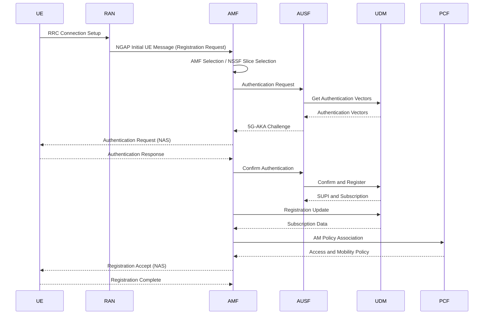
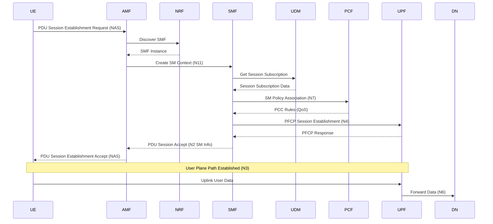
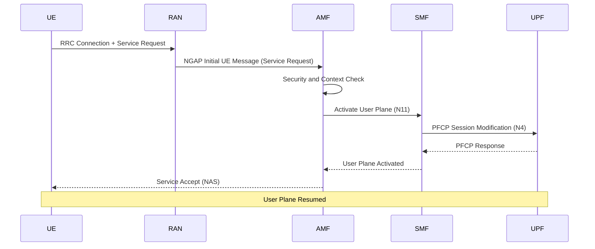
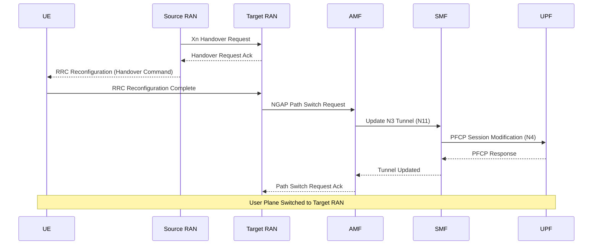
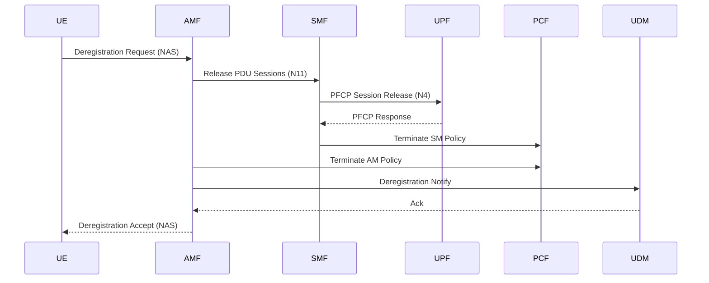
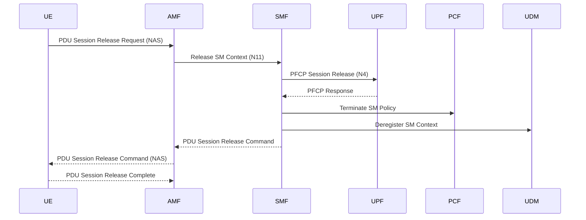

# 核心网流程

本篇依据 3GPP **TS 23.502**（5G 系统流程）介绍核心网的典型流程，每个流程给出**目的**、**涉及网元**、**时序图**与**关键步骤**。网元的功能定义见 [3GPP 网元功能](/docs/nf-functions)。

> 说明：时序图为简化示意，聚焦主要信令交互，省略了部分可选步骤与失败分支。

---

## 1. 注册流程（Registration，§4.2.2.2）

**目的**：UE 向网络注册以获得服务，完成鉴权并建立移动性上下文。

**涉及网元**：

| 网元 | 角色 |
|------|------|
| UE | 发起注册请求 |
| (R)AN | 无线接入，转发 NGAP 信令 |
| AMF | 注册 / 移动性锚点，安全锚点 |
| AUSF | 执行接入鉴权 |
| UDM | 提供认证向量与签约数据 |
| NSSF | 网络切片选择 |
| PCF | 提供接入与移动性策略 |

**关键步骤**：
1. UE 经 (R)AN 发送注册请求（N1/N2）。
2. AMF 选择 / 重定向，并经 NSSF 完成切片选择。
3. AMF 联合 AUSF / UDM 执行 5G-AKA 鉴权。
4. AMF 从 UDM 获取签约数据，向 PCF 建立 AM 策略关联。
5. AMF 下发 Registration Accept，UE 回复 Registration Complete。

---

## 2. PDU 会话建立（PDU Session Establishment，§4.3.2.2）

**目的**：为 UE 建立到数据网络（DN）的用户面连接，分配 IP 地址。

**涉及网元**：

| 网元 | 角色 |
|------|------|
| UE | 发起会话建立请求 |
| AMF | 转发会话管理信令，选择 SMF |
| NRF | SMF 服务发现 |
| SMF | 会话控制，选择 / 控制 UPF |
| UDM | 会话签约数据 |
| PCF | 会话策略（PCC / QoS） |
| UPF | 用户面锚点，数据转发 |
| DN | 外部数据网络 |

**关键步骤**：
1. UE 经 AMF 发起 PDU 会话建立请求。
2. AMF 通过 NRF 发现并选择 SMF，创建 SM 上下文。
3. SMF 从 UDM 获取会话签约数据，向 PCF 获取 PCC / QoS 策略。
4. SMF 通过 N4（PFCP）选择并配置 UPF，建立用户面隧道。
5. SMF 经 AMF 下发会话建立接受，UE 获得 IP 地址，用户面打通（N3/N6）。

---

## 3. 服务请求（Service Request，§4.2.3.2）

**目的**：将处于 CM-IDLE 的 UE 恢复到 CM-CONNECTED，重新激活用户面。

**涉及网元**：

| 网元 | 角色 |
|------|------|
| UE | 发起服务请求 |
| (R)AN | 重建无线连接 |
| AMF | 连接管理，触发用户面激活 |
| SMF | 会话上下文，激活 UPF |
| UPF | 恢复用户面转发 |

**关键步骤**：
1. UE 在空闲态发起服务请求，经 (R)AN 重建连接。
2. AMF 完成安全与上下文校验。
3. AMF 通知相关 SMF 激活用户面，SMF 通过 N4 更新 UPF。
4. AMF 下发 Service Accept，用户面恢复。

---

## 4. Xn 切换（Xn-based Handover，§4.9.1.2）

**目的**：UE 在两个基站之间移动时，将用户面从源 (R)AN 切换到目标 (R)AN。

**涉及网元**：

| 网元 | 角色 |
|------|------|
| UE | 执行无线切换 |
| Source (R)AN | 源基站，发起 Xn 切换 |
| Target (R)AN | 目标基站，接管 UE |
| AMF | 路径切换锚点 |
| SMF | 更新 N3 隧道 |
| UPF | 切换下行转发路径 |

**关键步骤**：
1. 源基站经 Xn 向目标基站发起切换准备。
2. UE 收到切换命令并接入目标基站。
3. 目标基站向 AMF 发起路径切换请求。
4. AMF 通知 SMF，SMF 通过 N4 更新 UPF 的下行隧道。
5. 用户面切换到目标基站，切换完成。

---

## 5. 去注册（Deregistration，§4.2.2.3）

**目的**：UE 从网络注销，释放注册上下文与相关会话。

**涉及网元**：

| 网元 | 角色 |
|------|------|
| UE | 发起去注册 |
| AMF | 清理注册上下文 |
| SMF | 释放 PDU 会话 |
| UPF | 释放用户面资源 |
| PCF | 终止策略关联 |
| UDM | 清除注册状态 |

**关键步骤**：
1. UE 发起去注册请求。
2. AMF 通知 SMF 释放所有 PDU 会话，SMF 释放 UPF 用户面资源。
3. AMF / SMF 终止与 PCF 的策略关联。
4. AMF 通知 UDM 清除注册状态。
5. AMF 下发起注册接受。

---

## 6. PDU 会话释放（PDU Session Release，§4.3.4）

**目的**：释放单个 PDU 会话及其用户面资源。

**涉及网元**：

| 网元 | 角色 |
|------|------|
| UE | 发起会话释放 |
| AMF | 转发会话管理信令 |
| SMF | 释放会话上下文 |
| UPF | 释放用户面隧道 |
| PCF | 终止会话策略 |
| UDM | 清除会话注册 |

**关键步骤**：
1. UE 发起 PDU 会话释放请求。
2. AMF 转发到 SMF，SMF 释放 SM 上下文。
3. SMF 通过 N4 释放 UPF 用户面隧道。
4. SMF 终止 PCF 会话策略，并向 UDM 清除会话注册。
5. SMF 经 AMF 下发释放命令，UE 回复释放完成。
